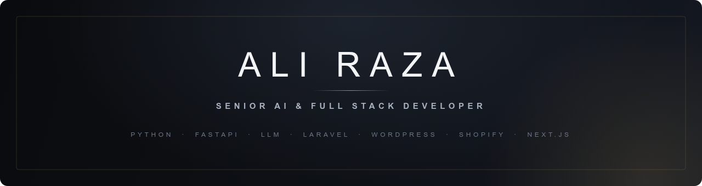
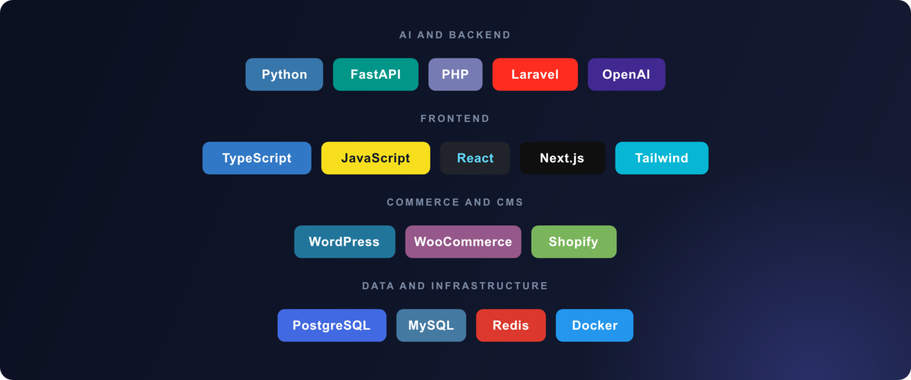

   

## About

I am a Senior AI and Full Stack Developer with 6+ years building e-commerce platforms, custom CMS
solutions, and AI powered automation for clients across the US, UK, and EU. I build software end to
end and care about the details that matter in production: idempotent APIs, queue based delivery, safe
concurrency, correct timezone handling, tested code, and CI/CD.

- Currently building Python and FastAPI services with LLM integrations (OpenAI, Claude, Gemini), including RAG pipelines and prompt evaluation.
- Deep background in WordPress, WooCommerce, Shopify, and Laravel for online stores.
- Author and maintainer of open source projects across AI, Laravel, WordPress, Shopify, and Next.js.
- Every project ships with tests, CI, and written design decisions.
- Based in Lahore, Pakistan and open to remote work.

## Tech Stack

## Featured Projects

| Project | Stack | What it is |
| --- | --- | --- |
| **[hook-relay](https://github.com/thealirazadev/hook-relay)** | Laravel | Inbound webhook gateway with per-provider signature verification, at least once delivery, a dead letter queue, and replay. |
| **[ticket-triage](https://github.com/thealirazadev/ticket-triage)** | Python, FastAPI | Triages support tickets with an LLM, with rule based routing, a labeled evaluation harness, and CI accuracy gating. |
| **[bookline](https://github.com/thealirazadev/bookline)** | Next.js, TypeScript | Appointment booking with timezone and DST correct slots and database level double booking prevention. |
| **[pulse-analytics](https://github.com/thealirazadev/pulse-analytics)** | Next.js, TypeScript | Privacy first, cookieless web analytics with rollup aggregation, goals, and a dashboard. |
| **[laravel-uptime](https://github.com/thealirazadev/laravel-uptime)** | Laravel | Uptime and SSL monitor with queued checks, flap suppression, public status pages, and alerting. |
| **[evalkit](https://github.com/thealirazadev/evalkit)** | Python | CLI for prompt regression testing with deterministic assertions and LLM as judge scoring. |

Every one of these builds green in CI, ships with real tests, and documents its design decisions in
the README.

## Get in touch

I am open to senior full stack, AI engineering, and e-commerce roles, contract or full time.

- Portfolio: https://ali-raza-ten.vercel.app
- LinkedIn: https://linkedin.com/in/ali-razabhatti
- Email: thealirazadev@gmail.com
